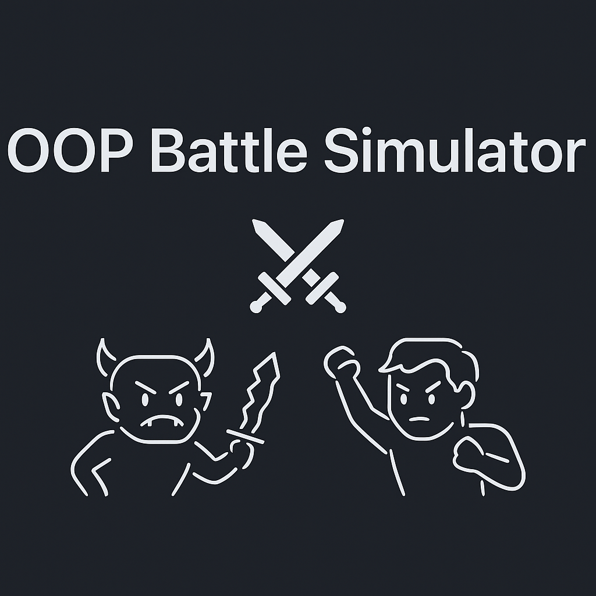
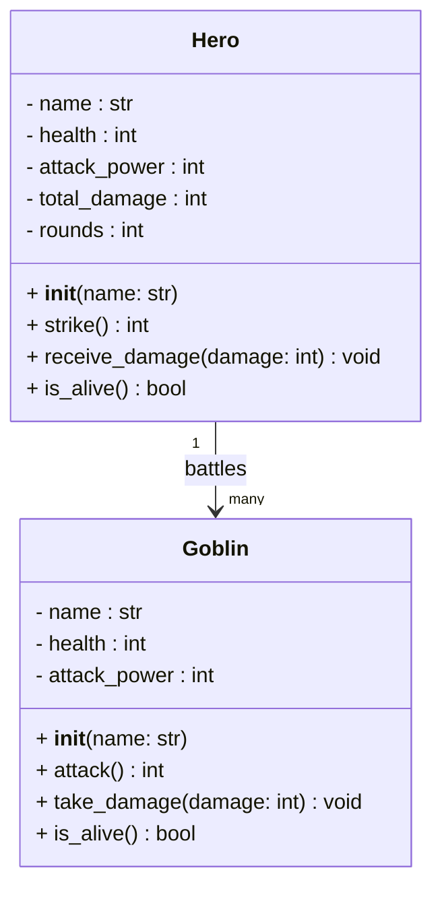

<p align="center">
  
</p>

A simple Python project designed to introduce **Object-Oriented Programming (OOP)** concepts through a turn-based battle between a **Hero** and a group of **Goblins**.  

This project demonstrates:
- Defining classes with attributes and methods  
- Encapsulation of state and behavior  
- Running a basic game loop  
- Tracking and reporting simple statistics  

---

## 📌 Project Goal
The main objective is to implement the **Hero** class so the battle simulation can run to completion.  
Students will practice:
- Initializing objects with attributes (name, health, attack power)  
- Writing methods for behavior (attack, take damage, check alive)  
- Managing state across a loop (rounds survived, total damage dealt)  

Stretch goals encourage extending the game with additional mechanics such as bosses, special abilities, or more detailed battle statistics.  

---

## 🗂 Project Structure
```plaintext
/ (repo root)
├─ game.py # Main game loop (orchestrates battle between hero and goblins)
├─ goblin.py # Goblin class (already implemented as a reference)
└─ hero.py # Hero class (to be implemented by students)
```


- **game.py** handles the round-based battle flow and printing results.  
- **goblin.py** provides a working enemy class as a model for the Hero.  
- **hero.py** contains TODOs where the Hero class must be completed.  

---

## 🧩 UML Class Diagram


## 🔄 Battle Flow

Hero strikes a random living goblin.

Goblin takes damage; if health reaches 0, it is defeated.

Each surviving goblin attacks the hero.

Repeat until either the hero falls or all goblins are defeated.

Print outcome and battle summary (damage dealt, rounds survived, goblins defeated).

## 🧪 Example Output
```plaintext
Welcome to the Battle Arena!
༼ ᓄºل͟º ༽ᓄ   ᕦ(ò_óˇ)ᕤ

New Round!
Hero attacks Goblin 2 for 12 damage!
Goblin 2 takes 12 damage. Health is now 88.
Goblin 1 attacks hero for 7 damage!
Goblin 3 attacks hero for 9 damage!

...

The hero has defeated all the goblins! ༼ ᕤ◕◡◕ ༽ᕤ

Battle Summary:
Total Goblins Defeated: 3 / 3
Total Damage Dealt: 124
Rounds Survived: 6
```

## 📖 Notes

Goblin is implemented as a reference.

Hero is intentionally incomplete and must be coded.

Damage values are randomized to keep each battle unique.

## 🌟 Stretch Ideas

Add a Goblin King boss class.

Give the Hero special abilities (heal, block, magic).

Track detailed statistics (crit rate, longest battle, etc.).

Add ASCII art or colorized output for flair.

## 📜 License

Educational use only — created for CYB 201 coursework.